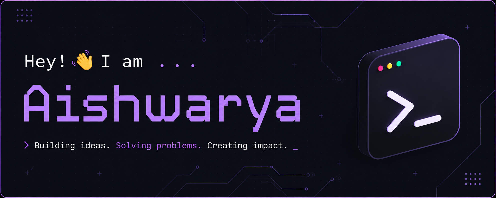

<strong><code>🤖 AI ML Engineer | 🧩 Systems Thinker | 🛠️ Builder </code></strong>

  

## ⌨️ What I Do

- Build **LLM-powered systems**: RAG pipelines, agentic workflows, and evaluation frameworks
- Design and develop **AI/ML applications** from experimentation to production
- Explore **LLM systems, retrieval, agents, and applied AI**

---
### 🧰 Tech Stack

---

## 📝 Philosophy

- Systems over demos  
- Fundamentals over frameworks  
- If I cannot build it, I do not understand it 

---

## Connect

  
  

